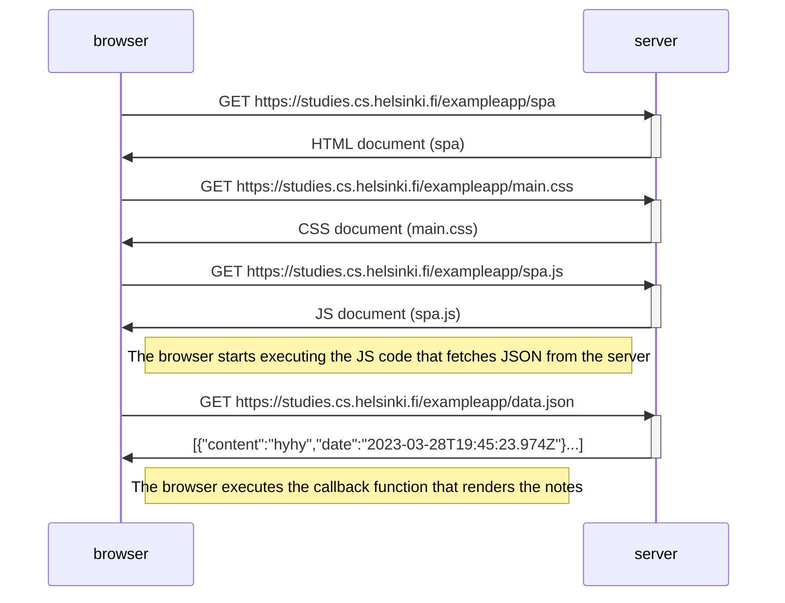

```mermaid
sequenceDiagram
    participant browser
    participant server

    browser->>server: GET https://studies.cs.helsinki.fi/exampleapp/spa
    activate server
    server->>browser: HTML document (spa)
    deactivate server

    browser->>server: GET https://studies.cs.helsinki.fi/exampleapp/main.css
    activate server
    server->>browser: CSS document (main.css) 
    deactivate server

    browser->>server: GET https://studies.cs.helsinki.fi/exampleapp/spa.js
    activate server
    server->>browser: JS document (spa.js)
    deactivate server

    Note right of browser: The browser starts executing the JS code that fetches JSON from the server

    browser->>server: GET https://studies.cs.helsinki.fi/exampleapp/data.json
    activate server
    server->>browser: [{"content":"hyhy","date":"2023-03-28T19:45:23.974Z"}...]
    deactivate server

    Note right of browser: The browser executes the callback function that renders the notes
```
